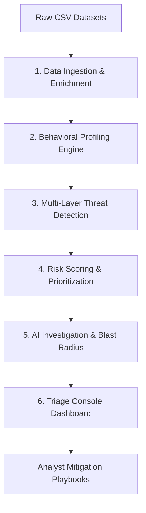

# Insider Threat Command Center: Data Access Audit & Anomaly Detection

An intelligent, real-time insider threat detection platform and triage console designed to monitor data access logs, detect security policy violations, evaluate behavioral anomalies relative to peer roles, and generate compliance-ready incident report playbooks.

Designed for security operations center (SOC) analysts to satisfy GDPR (Article 32), NIST (IR-4), and SOX (Section 302) compliance standards.

---

## 1. System Architecture (6-Layer Pipeline)

The platform is structured as a modular 6-layer data processing and triage pipeline, separating analytical logic from presentation:



### 📂 File Map
* **[`app.py`](file:///c:/Users/Dimpu/OneDrive/Desktop/SG/app.py)**: Flask backend API serving metrics, alerts database, chronological timeline segments, and persisting triage actions.
* **[`src/detector.py`](file:///c:/Users/Dimpu/OneDrive/Desktop/SG/src/detector.py)**: Pipeline engine orchestrator. Manages ingestion, enrichment, behavioral baselines, threat rule signatures, sequence kill chains, risk scoring weights, and blast radius calculation.
* **[`src/llm_explainer.py`](file:///c:/Users/Dimpu/OneDrive/Desktop/SG/src/llm_explainer.py)**: Gemini API client integration for automated AI incident summary generation (with robust local template failover).
* **[`static/`](file:///c:/Users/Dimpu/OneDrive/Desktop/SG/static/)**: Glassmorphism console assets:
  * **[`index.html`](file:///c:/Users/Dimpu/OneDrive/Desktop/SG/static/index.html)**: Structural layout (Feed log, user profile database, analytics, metrics validation tab, detail modal overlays, and report prints).
  * **[`app.js`](file:///c:/Users/Dimpu/OneDrive/Desktop/SG/static/app.js)**: Controller script (API data loading, Chart.js integrations, modal toggles, and printing templates).
  * **[`style.css`](file:///c:/Users/Dimpu/OneDrive/Desktop/SG/static/style.css)**: Stylesheet (dark-theme theme, grids, heatmap grids, timeline cards, and media print directives).

---

## 2. Advanced Analysis & Scoring Algorithms

The threat engine operates on a hybrid scoring methodology combining deterministic heuristic checks, chronological user drift profiling, department peer grouping, and stateful sequence tracking.

### A. Chronological User Baseline & Ingestion Leakage Prevention
To prevent data leakage during statistical validation, user baseline profiles are constructed **dynamically and chronologically**. For any given event log, the engine compiles a baseline profile utilizing only logs occurring *strictly before* the event's timestamp:
* **Time Affinity:** Ratio of historical queries executed inside specific buckets (`business_hours`, `night`, `weekend`, `unusual_hours`).
* **Resource Footprint:** Set of unique databases/resources historically queried.
* **Frequency Distribution:** Normal distribution ($\mu$, $\sigma$) of access queries executed per calendar day.

### B. Peer Group Deviation Analysis
Grouped by `department` + `job_title`, peer group profiles baseline time-affinity, resource, and action metrics for organizational units. For each access event, deviation is scored out of 100:
$$\text{PeerDeviation} = \text{TimeDeviation (40%)} + \text{ResourceDeviation (35%)} + \text{ActionDeviation (25%)}$$
This reduces false positives by accommodating approved off-hours work patterns typical of specific departments (e.g., IT admins working late).

### C. Stateful Sequence Kill-Chains
The engine monitors chronological sequences per user to identify multi-stage threat progression models:
1. **`BRUTE_FORCE_EXPLOIT`:** Sequential failed logins ($\ge 2$) $\rightarrow$ Successful login $\rightarrow$ High-sensitivity resource query within a 15-minute window.
2. **`DRIFT_EXFILTRATION`:** System drift access $\rightarrow$ High-sensitivity resource query $\rightarrow$ Data export action within a 30-minute window.
3. **`OFFHOURS_EXFILTRATION`:** Access timing outside business hours $\rightarrow$ High-sensitivity resource query $\rightarrow$ Data export action.

### D. Weighted Scoring Formula
To provide explainability, the engine computes risk scores deterministically based on weighted contributions, capped at 100:
$$\text{RiskScore} = (\text{RuleBaseScore} \times 0.40) + (\text{DriftScore} \times 0.25) + (\text{PeerDeviation} \times 0.15) + (\text{SensitivityVolume} \times 0.15) + (\text{KillChainBonus} \times 0.05)$$

* **Severity Tiers:**
  * **Critical:** $\ge 82$ (Immediate containment)
  * **High:** $67 - 81$ (Escalated monitoring)
  * **Medium:** $38 - 66$ (Weekly audit triage)
  * **Low:** $< 38$ (Monitor baseline)

---

## 3. Quantitative Blast Radius Assessment

To support SOC prioritization, the engine calculates a concrete quantitative blast radius for each threat:
* **Critical Systems Accessible:** Count of critical enterprise platforms (`PROD_DB`, `ADMIN_SYS`, `SIEM`, cloud IAM domains) listed in the user's approved profile credentials.
* **Estimated Record Exposure:** Projects maximum PII data loss based on the sensitivity of target tables and the method logged:
  * *High-sensitivity export:* 50,000 records
  * *Medium-sensitivity export:* 10,000 records
  * *High-sensitivity query/API:* 2,000 records
* **Business Impact Levels:** Maps credentials and system footprints to `CRITICAL` (Core databases/domains), `HIGH` (Cloud control planes), `MEDIUM` (Operational SaaS / Email), or `LOW` (Standard endpoint access).

---

## 4. User Interface Design & Visualizations

The glassmorphic dashboard offers a dark-themed Workspace tailored for threat analysts:
* **Active Anomaly Feed:** Real-time table displaying log telemetry, risk badge indicators, and row state tracking.
* **Unified Details Modal:** Launches a side-by-side pane upon alert selection:
  * *Left Panel:* Details table, dynamic progress meters breaking down risk weights, list of triggered policy rules, and a vertical chronological attack timeline.
  * *Right Panel:* Risk score conic rings, blast radius indicators, containment actions (disable user, escalate, dismiss), and the AI Narrative explanation.
* **Executive Summary Report:** Generates a printable monospaced plain-text incident compliance sheet.
* **Security Analytics Page:** Integrates Chart.js visualizations for volume progression, severity ratios, and the **Department Risk Matrix Heatmap** to display organizational hot-spots.
* **Evaluation Metrics Tab:** Displays engine validation parameters (Detection Coverage, Noise/FP Reduction, Threat Capture Rate) with a warning notice for missing label datasets.

---

## 5. Deployment Guide

### Prerequisites
Install dependencies listed in the requirements file:
```bash
pip install -r requirements.txt
```

### Configurations (.env)
To enable live AI Investigation summaries, create a `.env` file in the root directory and add your Google Gemini API Key:
```env
GEMINI_API_KEY=AIzaSy...your_api_key_here
```
*If omitted, the console automatically utilizes its template-based fallback.*

### Launching the console
Start the local Flask application:
```bash
python app.py
```
Open **[http://127.0.0.1:5000/](http://127.0.0.1:5000/)** in your browser to access the Insider Threat Command Center.
